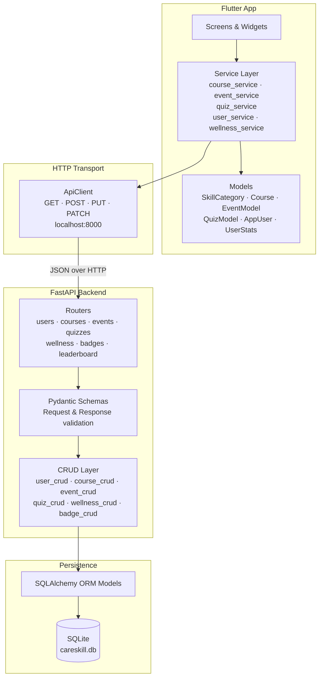
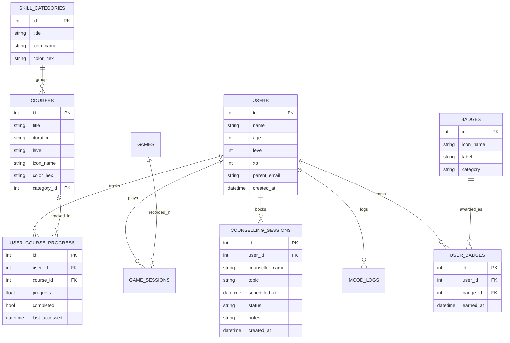
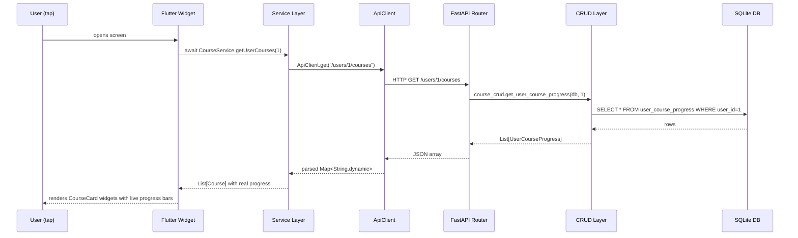
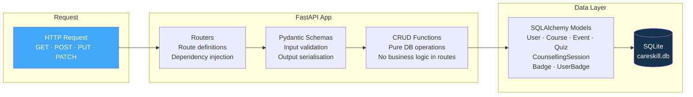

# CareSkill — NGO Learning Platform

A full-stack mobile application that helps children learn skills, participate in event-based quizzes, track wellness, and connect with counsellors. Built for NGO use with child-safety at its core.

---

## Table of Contents

- [Overview](#overview)
- [Features](#features)
- [Tech Stack](#tech-stack)
- [System Architecture](#system-architecture)
- [App Navigation Flowchart](#app-navigation-flowchart)
- [Database Schema](#database-schema)
- [API Request–Response Flow](#api-requestresponse-flow)
- [Backend Layer Diagram](#backend-layer-diagram)
- [Project Structure](#project-structure)
- [Quick Start](#quick-start)
- [API Endpoints](#api-endpoints)
- [Configuration](#configuration)

---

## Overview

CareSkill is an NGO-focused platform designed for children aged 8–16. It provides:

- Structured skill courses (coding, communication, cyber safety, art, music, languages)
- Event-based quizzes and daily challenges with XP rewards
- Private counselling session booking with trusted mentors
- A parent dashboard showing learning hours, quiz rank, and skill growth
- Safety awareness lessons with age-appropriate scenario choices

---

## Features

| Area | Capability |
|---|---|
| Home | Skill categories, daily challenge, safety story, upcoming counselling session |
| Learn | Courses with real-time progress bars synced from backend |
| Events | Event creation pipeline, quiz setup, selection, rewards, notifications |
| Wellness | Emergency help, counselling booking flow, protection lessons |
| Profile | User card (name/age/level/XP), earned badges, parent analytics tiles |

---

## Tech Stack

| Layer | Technology |
|---|---|
| Frontend | Flutter 3 · Dart · Material 3 |
| HTTP Client | `http` package (Dart) |
| Backend API | FastAPI (Python 3.11) |
| ORM | SQLAlchemy 2 |
| Database | SQLite (single-file, zero config) |
| Validation | Pydantic v2 |
| Server | Uvicorn (ASGI) |
| Package Manager | uv (Python) |

---

## System Architecture



---

## App Navigation Flowchart

```mermaid
flowchart TD
    LAUNCH([App Launch]) --> SHELL[AppShell\nBottom Navigation Bar]

    SHELL --> HOME[Home Dashboard]
    SHELL --> LEARN[Learn Screen]
    SHELL --> EVENTS[Events Screen]
    SHELL --> WELL[Wellness Screen]
    SHELL --> PROF[Profile Screen]

    HOME --> HC1[Skill Category Cards\nloaded from GET /categories]
    HOME --> HC2[Welcome Banner\nDaily Motivation]
    HOME --> HC3[Counselling Session Card\nloaded from GET /wellness/counselling]
    HOME --> HC4[Daily Challenge Card]
    HOME --> HC5[Safety Story\nChoice Scenario]
    HOME --> HC6[Parent Preview Panel]

    LEARN --> LC1[Search + Filter Chips]
    LEARN --> LC2[Course Cards\nloaded from GET /users/id/courses\nshows real progress bars]
    LEARN --> LC3[Course Detail Preview\nVideos · Notes · Quiz · Certificate]

    EVENTS --> EC1[Event List\nquiz events · daily challenges · drives]
    EVENTS --> EC2[Event Detail\nregistration · attached quiz]
    EVENTS --> EC3[Admin Event Pipeline\nquiz setup · selection · rewards]

    WELL --> WC1[Emergency Help Card\nCall button]
    WELL --> WC2[Action Grid\nBook · Mentor · Chat · Video]
    WELL --> WC3[Session Booking Flow\nTopic → Counsellor → Slot → Confirm]
    WELL --> WC4[Protection Lesson Card]

    PROF --> PC1[Profile Hero Card\nloaded from GET /users/id\nname · age · level · XP]
    PROF --> PC2[Skill Badges\nloaded from GET /users/id/badges]
    PROF --> PC3[Analytics Tiles\nloaded from GET /users/id/stats\nLearning · Growth · Rank]
    PROF --> PC4[Counselling History Card]

    style LAUNCH fill:#41A7F5,color:#fff
    style SHELL fill:#17324D,color:#fff
    style HOME fill:#DDF1FF
    style LEARN fill:#E0F8E8
    style EVENTS fill:#FFE7C8
    style WELL fill:#FFDCDC
    style PROF fill:#E9E2FF
```



---

## Database Schema



---

## API Request–Response Flow



---

## Backend Layer Diagram



---

## Project Structure

```
careskill/
├── lib/                            ← Flutter source
│   ├── main.dart                   ← App root + AppShell (bottom nav)
│   ├── app_state.dart              ← Current user ID (global)
│   ├── core/
│   │   └── colors.dart             ← AppColors constants
│   ├── models/
│   │   ├── api_models.dart         ← AppUser · UserStats · ApiCounsellingSession · UserBadge
│   │   ├── skill_category.dart     ← SkillCategory + fromJson
│   │   ├── course.dart             ← Course + fromJson + fromProgressJson
│   │   ├── event_models.dart       ← EventModel + event pipeline enums
│   │   └── quiz_models.dart        ← Quiz models + attempt results
│   ├── services/
│   │   ├── api_client.dart         ← Base HTTP client (baseUrl, timeout, error handling)
│   │   ├── user_service.dart       ← getUser · getUserStats · addXp
│   │   ├── course_service.dart     ← getCategories · getCourses · getUserCourses · updateProgress
│   │   ├── event_service.dart      ← event creation + registration
│   │   ├── quiz_service.dart       ← quiz creation + attempts
│   │   ├── wellness_service.dart   ← getSessions · bookSession
│   │   ├── badge_service.dart      ← getUserBadges · awardBadge
│   │   └── leaderboard_service.dart← getLeaderboard · getUserRank
│   ├── utils/
│   │   └── icon_mapper.dart        ← icon_name string → IconData · hex string → Color
│   ├── widgets/                    ← Shared widgets
│   │   ├── app_card.dart
│   │   ├── app_scroll_view.dart
│   │   ├── top_header.dart
│   │   ├── section_header.dart
│   │   ├── search_box.dart
│   │   └── filter_chip_label.dart
│   └── screens/
│       ├── home/                   ← HomeDashboard (categories + counselling from API)
│       ├── learn/                  ← LearnScreen (courses + progress from API)
│       ├── events/                 ← Events screen + admin event creation pipeline
│       ├── quiz/                   ← Quiz player and result screens
│       ├── wellness/               ← WellnessScreen (support and counselling)
│       └── profile/                ← ProfileScreen (user + stats + badges from API)
│
├── backend/                        ← Python FastAPI backend
│   ├── app/
│   │   ├── main.py                 ← FastAPI app + CORS + router registration
│   │   ├── config.py               ← Settings (DB URL, XP-per-level)
│   │   ├── database.py             ← SQLAlchemy engine + get_db dependency
│   │   ├── models/                 ← SQLAlchemy ORM models
│   │   │   ├── user.py
│   │   │   ├── course.py           ← SkillCategory · Course · UserCourseProgress
│   │   │   ├── event.py            ← Event pipeline · event quiz mapping
│   │   │   ├── quiz.py             ← Quiz · Question · Attempt
│   │   │   ├── wellness.py         ← CounsellingSession
│   │   │   └── badge.py            ← Badge · UserBadge
│   │   ├── schemas/                ← Pydantic request/response schemas
│   │   │   ├── user.py
│   │   │   ├── course.py
│   │   │   ├── event.py
│   │   │   ├── quiz.py
│   │   │   ├── wellness.py
│   │   │   └── badge.py
│   │   ├── crud/                   ← Database operations (no HTTP logic)
│   │   │   ├── user_crud.py
│   │   │   ├── course_crud.py
│   │   │   ├── event_crud.py
│   │   │   ├── quiz_crud.py
│   │   │   ├── wellness_crud.py
│   │   │   └── badge_crud.py
│   │   └── routers/                ← API route handlers
│   │       ├── users.py
│   │       ├── courses.py
│   │       ├── events.py
│   │       ├── quiz.py
│   │       ├── wellness.py
│   │       ├── badges.py
│   │       └── leaderboard.py
│   ├── seed.py                     ← One-time database seeding
│   └── requirements.txt
│
├── android/
├── ios/
├── pubspec.yaml
└── README.md
```

---

## Quick Start

### Prerequisites

| Tool | Version |
|---|---|
| Flutter | 3.x |
| Dart | 3.x |
| Python | 3.11 |
| uv | latest |

### 1 — Clone and install

```bash
git clone <repo-url>
cd careskill
```

### 2 — Backend setup

```bash
cd backend

# Create virtual environment with Python 3.11
uv venv .venv --python python3.11

# Install dependencies
uv pip install -r requirements.txt --python .venv/bin/python

# Seed the database with demo data (run once)
.venv/bin/python seed.py

# Start the API server
.venv/bin/uvicorn app.main:app --reload --host 0.0.0.0 --port 8000
```

The API is now running at `http://localhost:8000`.
Interactive docs: `http://localhost:8000/docs`

### 3 — Flutter setup

```bash
# From project root
flutter pub get
flutter run
```

### 4 — Android emulator note

When running on an Android emulator, `localhost` inside the emulator refers to the emulator itself, not your machine. Change the base URL in [lib/services/api_client.dart](lib/services/api_client.dart):

```dart
// Android emulator
static const String baseUrl = 'http://10.0.2.2:8000';

// iOS simulator / desktop / web
static const String baseUrl = 'http://localhost:8000';

// Physical device (use your machine's local IP)
static const String baseUrl = 'http://192.168.x.x:8000';
```

---

## API Endpoints

### Users
| Method | Path | Description |
|---|---|---|
| `GET` | `/users/` | List all users |
| `POST` | `/users/` | Create user |
| `GET` | `/users/{id}` | Get user profile |
| `PATCH` | `/users/{id}` | Update user |
| `POST` | `/users/{id}/xp` | Add XP (auto-levels up) |
| `GET` | `/users/{id}/stats` | Weekly learning, skill growth %, quiz rank |

### Courses
| Method | Path | Description |
|---|---|---|
| `GET` | `/categories` | Skill category list |
| `GET` | `/courses` | All courses |
| `GET` | `/courses/{id}` | Single course |
| `GET` | `/users/{id}/courses` | User's courses with real progress |
| `PUT` | `/users/{id}/courses/{cid}/progress` | Update progress (0.0–1.0) |

### Wellness
| Method | Path | Description |
|---|---|---|
| `GET` | `/users/{id}/wellness/counselling` | All counselling sessions |
| `POST` | `/users/{id}/wellness/counselling` | Book a session |
| `PATCH` | `/users/{id}/wellness/counselling/{sid}` | Update status / add notes |

### Badges & Leaderboard
| Method | Path | Description |
|---|---|---|
| `GET` | `/badges` | All available badges |
| `GET` | `/users/{id}/badges` | User's earned badges |
| `POST` | `/users/{id}/badges/{bid}` | Award badge (idempotent) |
| `GET` | `/leaderboard/?limit=10` | Top N users by XP |
| `GET` | `/leaderboard/{id}/rank` | User's current rank |

---

## Configuration

### Backend — `backend/app/config.py`

```python
database_url = "sqlite:///./careskill.db"   # change to PostgreSQL for production
xp_per_level = 500                           # XP needed per level-up
```

### Frontend — `lib/services/api_client.dart`

```dart
static const String baseUrl = 'http://localhost:8000';
static const Duration _timeout = Duration(seconds: 10);
```

### Flutter app colours — `lib/core/colors.dart`

| Name | Hex | Used for |
|---|---|---|
| `primary` | `#41A7F5` | Buttons, indicators, primary actions |
| `secondary` | `#70D98B` | Success states, secondary actions |
| `accent` | `#FFA23A` | XP highlights and accents |
| `background` | `#FFFBF2` | App scaffold background |
| `mint` | `#BDF4D1` | Motivation cards, protection lessons |
| `softRed` | `#FF7D7D` | Emergency help, danger choices |
| `ink` | `#17324D` | Primary text |
| `muted` | `#6F7E8D` | Secondary text, subtitles |
| `lavender` | `#E9E2FF` | Counselling avatar, video action card |
