# Application Usage Guide
## CareSkill NGO Platform — Step-by-Step Guide for All Roles

---

## Table of Contents

1. [Workflow Diagrams](#workflow-diagrams)
   - [Platform Role Hierarchy](#platform-role-hierarchy)
   - [Registration & Approval Flow](#registration--approval-flow)
   - [School Counselling End-to-End](#school-counselling-end-to-end-sequence)
   - [Volunteer Activity Flow](#volunteer-activity-flow)
   - [Content Publishing Flow](#content-publishing-flow)
   - [Event Pipeline Flow](#event-pipeline-flow)
   - [Counselling Request Status States](#counselling-request-status-states)
2. [Student / Youth Member](#2-student--youth-member)
3. [Admin / Super Admin](#3-admin--super-admin)
4. [Event Manager](#4-event-manager)
5. [Counsellor (Mentor)](#5-counsellor-mentor)
6. [Content Creator](#6-content-creator)
7. [School Partner](#7-school-partner)

---

## Workflow Diagrams

### Platform Role Hierarchy

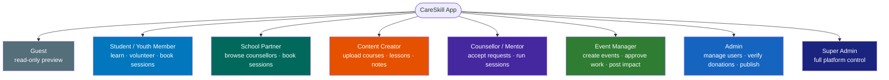

---

### Registration & Approval Flow

> Applies to every new user regardless of role.

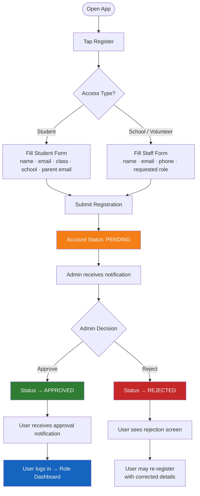

---

### School Counselling End-to-End Sequence

> Shows every actor involved from booking through session completion.

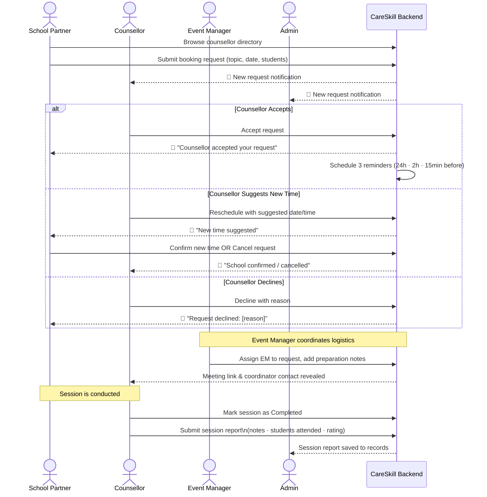

---

### Volunteer Activity Flow

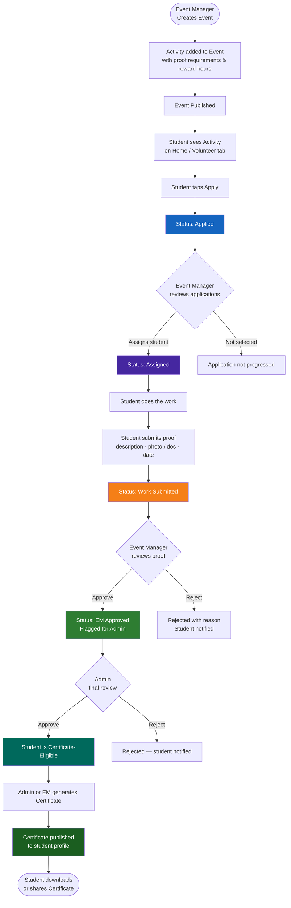

---

### Content Publishing Flow

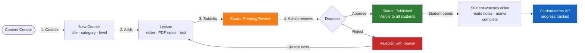

---

### Event Pipeline Flow

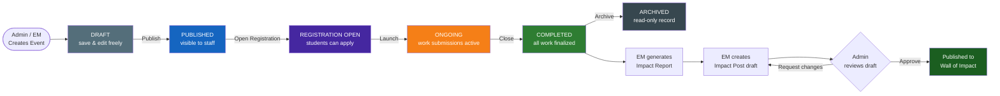

---

### Counselling Request Status States

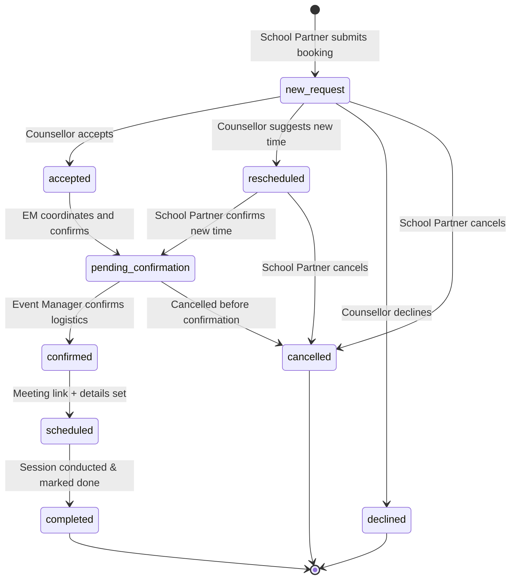

---

## 2. Student / Youth Member

### Flow Overview

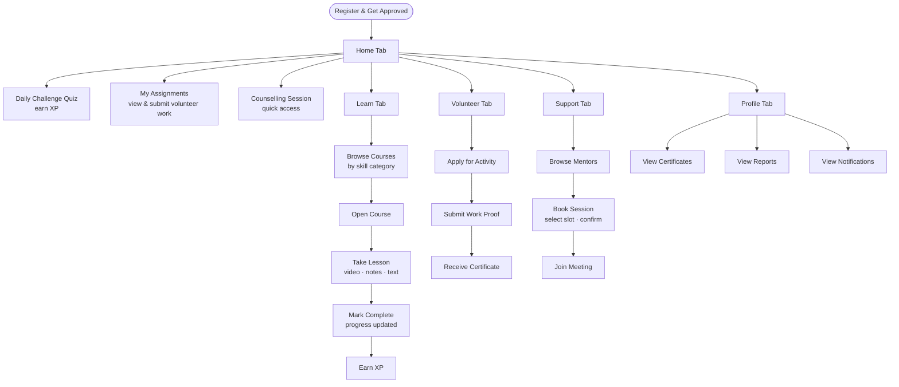

### Registration & First Login

**Step 1 — Open the App**
- Launch the CareSkill app on your Android device.
- You will land on the Login / Register screen.

**Step 2 — Create Your Account**
- Tap the **Register** tab at the top.
- Select your access type: **Student** or **School / Volunteer**.
- Fill in the registration form:
  - Full Name, Email Address, Password & Confirm Password
  - Age, Class / Grade, School Name, Location (City), Phone Number, Parent / Guardian Email
- If applying for a non-student role (e.g., Volunteer, Event Support), select it in the **Requested Role** field.
- Tap **Register**.

**Step 3 — Wait for Account Approval**
- After registering, your account will show a **Pending Approval** screen.
- An Admin will review your registration and approve or reject it.
- You will receive an in-app notification once the decision is made.

**Step 4 — Login After Approval**
- Enter your registered email and password → Tap **Sign In**.
- You are now inside the Student dashboard.

---

### Home Screen (Tab 1)

**Step 5 — Explore the Home Screen**
- At the top you see your **Daily Motivation Card** — an inspirational quote refreshed daily.
- Below that is the **Continue Learning** section showing your last accessed course.
- Scroll down to see **Skill Categories** — tap any to open Learn filtered by that skill.

**Step 6 — Daily Challenge (Quiz)**
- Find the **Daily Challenge** card on the Home screen.
- Tap **Start Challenge** to open a quiz tied to today's topic.
- Answer all questions and tap **Submit** to see your score and earn XP points.

**Step 7 — My Assignments**
- Scroll down on Home to find **My Assignments** — volunteer activities you have been assigned to.
- Tap any assignment card to see details and submit your work.

**Step 8 — Open Activities**
- Below assignments is **Open Activities** — upcoming volunteer opportunities you can apply for.
- Tap **Apply** on any activity card to submit your application.
- Application status progresses: Applied → Assigned → Work Submitted → Verified.

**Step 9 — Counselling Session Quick Access**
- The **Counselling Session** card on Home shows your next upcoming session with a mentor.
- Tap **Book** to go directly to the session booking flow.

---

### Learn (Tab 2)

**Step 10 — Browse Courses**
- Tap the **Learn** tab (book icon) at the bottom navigation bar.
- Browse courses organized by skill categories: Defence, Wellness, Career, Safety, etc.

**Step 11 — Open a Course**
- Tap any course card to open the **Course Detail** screen.
- Read the description, see lessons, and check your progress bar.
- Tap **Start Learning** or **Continue**.

**Step 12 — Take a Lesson**
- Inside a course, tap any lesson from the list.
- A lesson can contain: video content, PDF notes / study material, and text explanations.
- After completing a lesson, tap **Mark as Complete** to record your progress.

---

### Volunteer / Internship (Tab 3)

**Step 13 — View Your Volunteer Dashboard**
- Tap the **Volunteer** tab (heart icon).
- At the top you see your stats: total hours earned, XP, activities completed, certificates issued.

**Step 14 — Apply for an Activity**
- Tap **Browse Activities** to see all open volunteer opportunities.
- Tap any activity card to view full details, then tap **Apply for This Activity**.

**Step 15 — Submit Your Work**
- After being assigned, tap **Submit Work** on the activity card.
- Fill in: description of work done, upload proof (photo / document / link), date of completion.
- Tap **Submit** to send for verification.

**Step 16 — Make a Donation**
- Tap **Donate** on the Volunteer dashboard.
- Select the activity or cause, enter the amount, upload payment proof, tap **Submit Donation Proof**.

**Step 17 — Log Daily Volunteer Hours**
- Tap **Daily Log** → select the date, activity, and hours spent → Tap **Save Log**.

**Step 18 — View My Certificates**
- Tap **My Certificates** to see all certificates you have earned.
- Certificates are generated automatically once your work is approved.

**Step 19 — Wall of Impact**
- Tap **Wall of Impact** to view published impact stories from the NGO.
- Tap the heart icon on any post to appreciate it.

---

### Helping & Support (Tab 4)

**Step 20 — Browse Mentors**
- Tap the **Support** tab (headset icon).
- View the list of available mentors, filter by specialization or language.

**Step 21 — Book a Counselling Session**
- On a mentor's profile, tap **Book a Session**.
- Select an available time slot → Tap **Confirm Booking**.
- If the mentor has added a Google Meet link, tap **Join Meeting** directly.

**Step 22 — View My Sessions**
- Tap **My Sessions** to view all upcoming and past counselling sessions.

**Step 23 — Wellness & Safety Resources**
- On the Support screen scroll down to access: Safety Awareness, Emergency Contacts, Wellness Exercises.

---

### Profile (Tab 5)

**Step 24 — View Your Profile**
- Tap the **Profile** tab to see your name, level, XP, and profile photo.

**Step 25 — View Certificates & Reports**
- Tap **Certificates** or **Reports** on the Profile screen.

**Step 26 — Notifications**
- Tap the **Bell** icon to view all in-app notifications.

**Step 27 — Settings**
- Tap the **Gear** icon → update profile details, change password, or **Sign Out**.

---

## 3. Admin / Super Admin

### Flow Overview

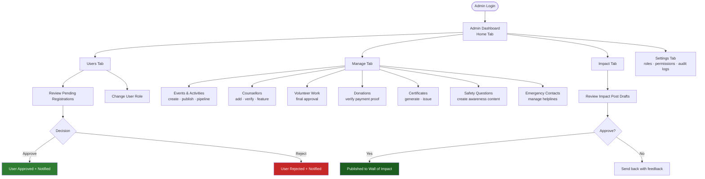

### Login

**Step 1 — Login**
- Open the app and enter your admin credentials on the Login screen → Tap **Sign In**.
- You are taken directly to the **Admin Dashboard**.

---

### Home (Tab 1)

**Step 2 — View Admin Overview**
- The Home screen shows key platform metrics:
  - **Pending Users** — users waiting for account approval.
  - **Active Events** — currently running events.
  - **Platform Analytics** — impact posts published, volunteers active, certificates generated.

**Step 3 — Quick Action Shortcuts from Home**
- Tap any quick action: View Pending, Open Users, Open Events, Open Counselling, Open Safety, Open Emergency, Open Volunteer.

---

### Users (Tab 2)

**Step 4 — Search & Filter Users**
- Tap the **Users** tab → view all registered users.
- Use the search bar or filter by role or status (pending / approved / rejected).

**Step 5 — Approve or Reject a Registration**
- Tap any user with *Pending* status.
- Review their details → Tap **Approve** or **Reject**.
- The user receives an in-app notification immediately.

**Step 6 — Change a User's Role**
- Open a user's detail screen → Tap **Change Role** → Select the new role → Tap **Confirm**.

---

### Manage (Tab 3)

**Step 7 — Access the Manage Hub**
- Tap the **Manage** tab → grid of management tools covering every platform module.

#### Events & Activities

**Step 8 — Create a New Event**
- Tap **Events & Activities** → Tap **+ Create Event**.
- Complete the multi-step event creation wizard:
  - Step 1: Basic info — title, description, category, start and end dates
  - Step 2: Location / mode — online or offline, venue or meeting link
  - Step 3: Activities — add volunteer tasks with reward hours and proof requirements
  - Step 4: Registration settings — open registration, eligibility criteria
  - Step 5: Notifications — set up alerts for participants
- Tap **Publish** to make the event live or **Save as Draft** to review later.

**Step 9 — Manage the Event Pipeline**
- Tap **Event Pipeline** → browse stages: Draft → Published → Registration Open → Ongoing → Completed → Archived.
- Tap any event to open its full pipeline detail with sub-tabs: Overview, Activities, Volunteers, Reports.

#### Counsellors

**Step 10 — Add a New Counsellor**
- Tap **Counsellors** → Tap **Add Counsellor** (+ icon).
- Fill in the counsellor profile form: name, designation, category, bio, expertise areas, session topics, available slots, qualifications, recognitions.
- Toggle **Featured**, **Active**, and **Verified** as appropriate → Tap **Save Counsellor Profile**.

**Step 11 — Manage School Requests**
- Tap **School Requests** to view all incoming school counselling bookings and their current status.

#### Volunteer Work

**Step 12 — Review Volunteer Submissions**
- Tap **Volunteer Work** → see all submitted proof waiting for final admin approval.
- Tap a submission → view description and proof → Tap **Approve** or **Reject**.

#### Donations & Certificates

**Step 13 — Verify a Donation**
- Tap **Donations & Stipends** → view pending donation proofs.
- Tap a donation → view screenshot / receipt → Tap **Verify** or **Reject**.

**Step 14 — Issue Certificates**
- Tap **Certificates** → view certificate-eligible students.
- Tap **Generate Certificate** → Tap **Approve & Issue** to publish to the student's profile.

---

### Impact (Tab 4)

**Step 15 — Review and Publish Impact Posts**
- Tap the **Impact** tab → view draft posts submitted by Event Managers.
- Tap any draft → Tap **Approve & Publish** or **Request Changes**.

---

### Settings (Tab 5)

**Step 16 — Platform Settings**
- Tap the **Settings** tab → configure User Management, Role & Access Control, Security, Notification Settings, and Advanced Settings.

---

## 4. Event Manager

### Flow Overview

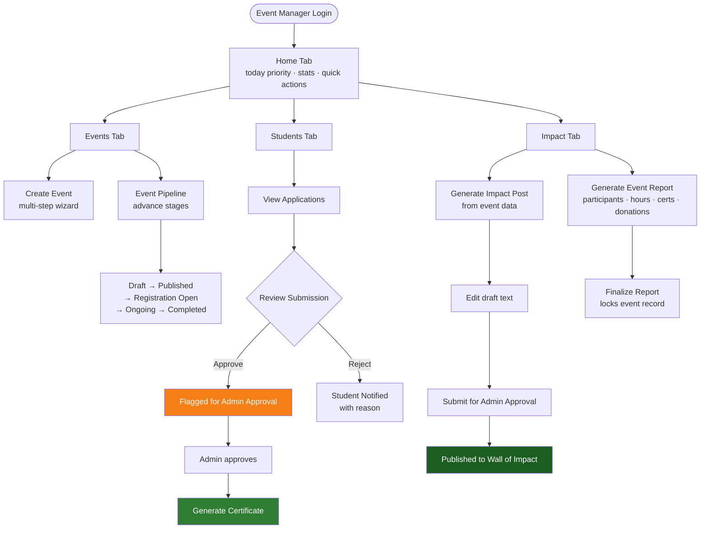

### Login

**Step 1 — Login**
- Enter your Event Manager credentials → Tap **Sign In**.
- You are directed to the **Event Manager Dashboard**.

---

### Home (Tab 1)

**Step 2 — View Today's Priority**
- Home shows the **Today's Priority Card** and a **Stats Row**: Total Events, Active Volunteers, Pending Submissions, Impact Drafts.

**Step 3 — Use Quick Actions**
- Tap any Quick Action: Approve Submissions, Create Event, Review Pipeline, Post Impact.

---

### Events (Tab 2)

**Step 4 — View All Your Events**
- Tap the **Events** tab → browse all events across pipeline stages.

**Step 5 — Create a New Event**
- Tap the **+** button → complete the multi-step event creation wizard → Tap **Save as Draft** or **Publish**.

**Step 6 — Advance an Event's Status**
- Open any event → Tap **Advance Status** to move it through the pipeline:
  - Draft → Published → Registration Open → Ongoing → Completed.

---

### Students (Tab 3)

**Step 7 — View All Student Applications**
- Tap the **Students** tab → see all students who have applied for activities.
- Filter by event, activity, or submission status.

**Step 8 — Review and Approve a Work Submission**
- Tap any student entry to open the **Submission Review** screen.
- Read their work description and view uploaded proof.
- Tap **Approve Submission** or **Reject** (with reason).
- The student receives an in-app notification immediately.

**Step 9 — Send for Admin Approval**
- After approving a submission, tap **Mark for Admin Approval** to flag it for final admin review.

**Step 10 — Generate a Certificate**
- Once admin has also approved, tap **Generate Certificate** on the assignment detail screen.

---

### Impact (Tab 4)

**Step 11 — Generate an Impact Draft**
- Tap the **Impact** tab → select a completed event → Tap **Generate Impact Draft**.

**Step 12 — Edit and Submit for Admin Approval**
- Review the auto-generated post → edit text if needed → Tap **Submit for Admin Approval**.

**Step 13 — Generate an Event Report**
- Tap **Generate Report** for any completed event.
- The report includes: total participants, hours contributed, work submitted, certificates issued, donation amounts.
- Tap **Finalize Report** to lock the report and close the event record.

---

## 5. Counsellor (Mentor)

### Flow Overview

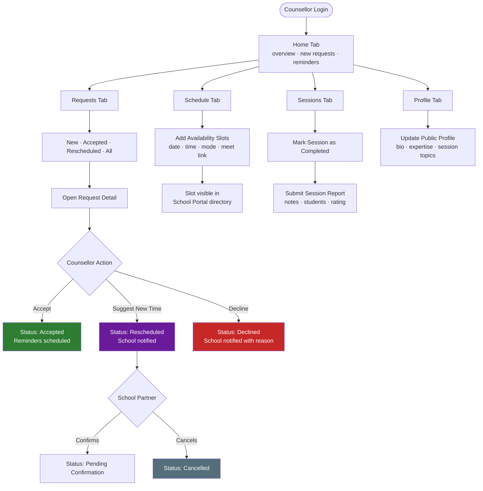

### Login

**Step 1 — Login**
- Enter your counsellor credentials → Tap **Sign In**.
- You are directed to the **Counsellor Dashboard**.

---

### Home (Tab 1)

**Step 2 — View Today's Overview**
- Home shows: Overview Cards (total requests, sessions today, completed overall), New Requests Section, Upcoming Reminders.

**Step 3 — Respond to a New Request from Home**
- Tap any request card → Tap **Accept**, **Suggest New Time**, or **Decline**.
- The school is notified automatically of your response.

---

### Requests (Tab 2)

**Step 4 — View All School Requests**
- Tap the **Requests** tab → four sub-tabs: **New** · **Accepted** · **Rescheduled** · **All**.

**Step 5 — Open a Request Detail**
- Tap any request card to open the **Meeting Detail Screen** with complete session information.

**Step 6 — Accept a Request**
- Tap **Accept** → school receives a notification → three reminders are auto-scheduled.

**Step 7 — Decline a Request**
- Tap **Decline** → select a reason → add an optional note → Tap **Confirm Decline**.

**Step 8 — Suggest a New Time**
- Tap **Suggest New Time** → pick an alternative date/time → Tap **Send Suggestion**.
- The school receives a notification and can confirm or reject the new time.

---

### Schedule (Tab 3)

**Step 9 — View Your Availability Calendar**
- Tap the **Schedule** tab → calendar view with all confirmed and upcoming sessions.

**Step 10 — Add Availability Slots**
- Tap the **+** / **Add Availability** button.
- Set start/end date-time, session topic, recurrence, and optional Google Meet URL → Tap **Save Slot**.

**Step 11 — Edit or Delete a Slot**
- Tap any existing availability slot → Tap **Edit** or **Delete**.

---

### Sessions (Tab 4)

**Step 12 — View Accepted & Upcoming Sessions**
- Tap the **Sessions** tab → statuses: Accepted, Confirmed, Scheduled, Completed.

**Step 13 — Mark a Session as Completed**
- Tap a session card → Tap **Mark as Completed**.

**Step 14 — Submit a Session Report**
- Tap **Submit Report** → fill in: counsellor notes, students attended, school feedback, rating (1–5) → Tap **Submit Report**.

---

### Profile (Tab 5)

**Step 15 — Update Your Public Profile**
- Tap the **Profile** tab → update photo, bio, designation, languages, expertise, session topics, and mode availability → Tap **Save Profile**.

---

## 6. Content Creator

### Flow Overview

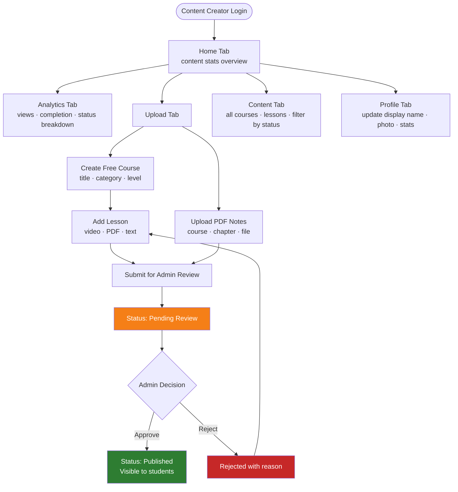

### Login

**Step 1 — Login**
- Enter your Content Creator credentials → Tap **Sign In**.
- You are directed to the **Content Creator Dashboard**.

---

### Home (Tab 1)

**Step 2 — View Your Content Overview**
- Home shows: total content items uploaded, published items, pending review items, total views.

---

### Analytics (Tab 2)

**Step 3 — View Content Performance Analytics**
- Tap the **Analytics** tab → views per course and lesson, student engagement, completion rates, publication status breakdown.

---

### Upload (Tab 3)

**Step 4 — Create a New Free Course**
- Tap the **Upload** tab → Tap **Create Free Course**.
- Fill in: course title, description, skill category, thumbnail image, difficulty level → Tap **Create Course**.

**Step 5 — Add a Lesson to a Course**
- Tap **Add Lesson** → select which course this lesson belongs to.
- Fill in: lesson title, description, chapter/subject, upload video (mp4) or PDF notes, add text content.
- Tap **Submit for Review** → sent to admin for approval before going live.

**Step 6 — Upload PDF Notes Directly**
- Tap **Upload PDF Notes** → select course and chapter → upload PDF → add title and description → Tap **Submit**.

**Step 7 — Review Your Pending Submissions**
- Tap **Review Pending** → see all lessons and notes awaiting admin approval.
- Tap any item to view its current status: Pending, Approved, or Rejected.

---

### Content (Tab 4)

**Step 8 — Browse All Your Uploaded Content**
- Tap the **Content** tab → view all courses and lessons.
- Filter by status: All, Published, Pending Review, Draft.

---

### Profile (Tab 5)

**Step 9 — Update Your Creator Profile**
- Tap the **Profile** tab → update display name and profile photo → view content contribution statistics.

---

## 7. School Partner

### Flow Overview

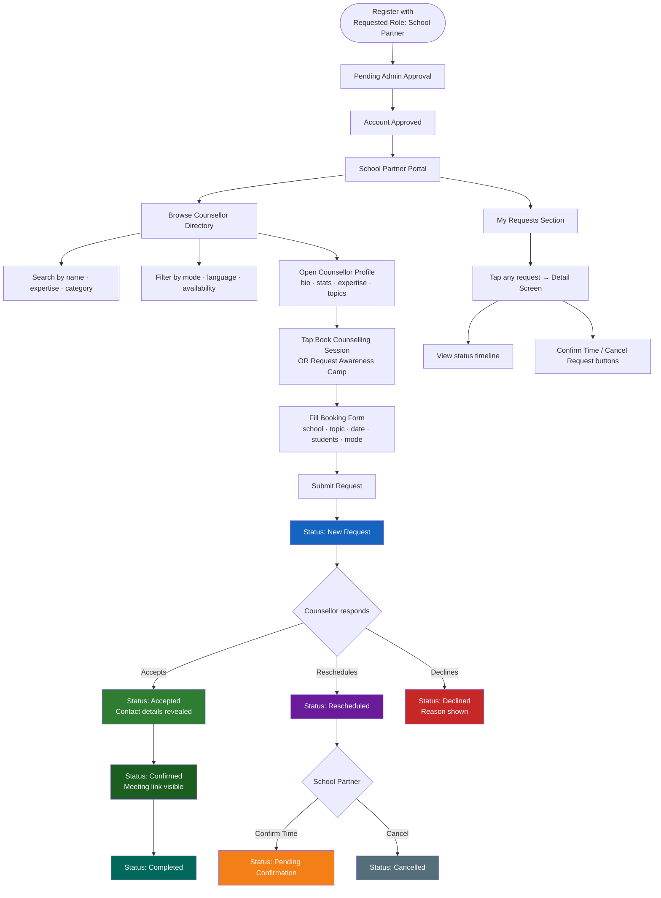

### Registration

**Step 1 — Register as a School Partner**
- Open the app → Tap **Register**.
- Select **School / Volunteer** as your access type.
- Fill in the registration form with your school and personal details.
- In the **Requested Role** dropdown, select **School Partner**.
- Submit and wait for Admin approval.

---

### Accessing the School Partner Portal

**Step 2 — Login After Approval**
- Enter your approved School Partner credentials → Tap **Sign In**.
- You are taken directly to the **School Partner Portal** screen.

---

### Portal Home Screen

**Step 3 — View the Portal Dashboard**
- The Portal home shows:
  - A **welcome banner** with the NGO trust and verification statement.
  - Two action cards: **Browse Counsellors** and **Book a Session** (both open the directory).
  - A **Recent Requests** section showing your booking history and status.
- Tap any request card to open its full **Request Detail Screen**.

---

### Browsing the Counsellor Directory

**Step 4 — Open the Counsellor Directory**
- Tap **Browse Counsellors** or **Book a Session** on the portal home.

**Step 5 — Search for a Counsellor**
- Use the **Search bar** to search by name, designation, or area of expertise.

**Step 6 — Filter the Directory**
- Tap filter chips to filter by:
  - **Category** — Retired Army Officer, Education Counsellor, Mental Wellness, Cyber Safety, etc.
  - **Session Mode** — Online, Offline, or Both
  - **Language** — English, Punjabi, Hindi, etc.
  - **Available This Week** — toggle to show only currently available counsellors
  - **Featured Only** — toggle to show only NGO-recommended counsellors

**Step 7 — Browse Featured Counsellors**
- Scroll down to the **Featured Counsellors** horizontal carousel.
- Tap any featured card to open their full profile.

**Step 8 — Open a Counsellor's Full Profile**
- Tap any counsellor card.
- The **Full Profile Screen** shows: name, photo, category badge, verified status, stats (sessions, students, experience), bio, designation, expertise tags, session topics, qualifications, session details, and privacy policy.

---

### Booking a Counselling Session

**Step 9 — Start a Booking Request**
- On the counsellor's profile screen, scroll to the bottom action buttons.
- Tap **Book a Counselling Session** for a regular session.
- OR tap **Request Awareness Camp** for a large-group program.

**Step 10 — Fill in the Booking Form**
- Complete all fields in the form sheet:
  - **School Name**, **Principal / Coordinator Name**, **School Email**
  - **Session Topic** — select from the counsellor's listed topics
  - **Preferred Date** — at least 3 days in advance
  - **Session Mode** — Online or Offline
  - **Expected Student Count**, **Grade / Class Group**, **Special Requirements**
- Tap **Submit Booking Request**.

**Step 11 — Request Submitted**
- A green success notification appears.
- The counsellor and NGO Admin both receive in-app notifications.

---

### After Submitting a Request

**Step 12 — Track Request Status**
- Return to the **School Partner Portal** home screen.
- Tap any request card to open the full **Request Detail Screen** showing:
  - Complete request info, schedule, and status banner with a plain-language explanation.
  - **Timeline** of key events (submitted, accepted, confirmed, completed).
  - **Meeting link** (once confirmed/scheduled).
  - Rescheduled time card (if counsellor suggested a new time).

**Step 13 — Receive Status Notifications**
- When the counsellor accepts, declines, or suggests a new time, you receive an in-app notification.
- Tap the notification to go directly to your request detail.

**Step 14 — Confirm or Decline a Rescheduled Time**
- If the counsellor suggested a new time, open the request detail.
- Review the suggested date and time.
- Tap **Confirm New Time** to accept it → status moves to **Pending Confirmation**.
- Tap **Cancel Request** to cancel entirely.

---

## General Notes for All Roles

### In-App Notifications

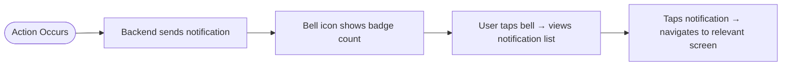

- All users receive real-time in-app notifications for actions relevant to their role.
- Tap the **Bell** icon in your profile screen to view all past notifications.
- Unread notifications show a badge count on the icon.

---

### Sign Out
- Go to your **Profile** tab → Tap **Sign Out** at the bottom.
- You are returned to the Login screen.

---

### Password Reset
- On the Login screen, tap **Forgot Password?**
- Enter your registered email address.
- Check your email for a reset link and follow the instructions to set a new password.

---

### Role Upgrade Requests
- A registered user can request a role change (e.g., from Student to Volunteer) during registration by selecting their desired role in the **Requested Role** field.
- The admin reviews and approves or rejects role change requests from the Users management screen.
