# CareSkill — Complete Project Description

> NGO Learning & Counselling Platform  
> Stack: Flutter (MVVM) + FastAPI + SQLite + Google Calendar API + Auth0 + WebSocket

---

## Table of Contents

1. [Tech Stack](#tech-stack)
2. [System Architecture](#system-architecture)
3. [Role Hierarchy & Permissions](#role-hierarchy--permissions)
4. [App Navigation Structure](#app-navigation-structure)
5. [Authentication Flow](#authentication-flow)
6. [State Management Pattern](#state-management-pattern)
7. [Feature: Home](#feature-home)
8. [Feature: Learn](#feature-learn)
9. [Feature: Events](#feature-events)
10. [Feature: Helping Support & Counselling](#feature-helping-support--counselling)
11. [Feature: Chat (WebSocket)](#feature-chat-websocket)
12. [Feature: Profile & Badges](#feature-profile--badges)
13. [Google Meet Auto-Generation Flow](#google-meet-auto-generation-flow)
14. [Backend API Map](#backend-api-map)
15. [Database Models](#database-models)
16. [Data Flow: ViewState Lifecycle](#data-flow-viewstate-lifecycle)

---

## Tech Stack

| Layer | Technology |
|-------|-----------|
| Frontend | Flutter (Dart), Material 3, MVVM |
| HTTP Client | `package:http` via `ApiClient` |
| WebSocket | `web_socket_channel` |
| Auth | Auth0 (Native OAuth) + JWT (local email/password) |
| Backend | FastAPI (Python 3.11) |
| Database | SQLite via SQLAlchemy ORM + Alembic |
| Calendar/Meet | Google Calendar API v3 (OAuth2) |
| Tunnelling | ngrok (dev) |
| Testing | pytest + FastAPI TestClient |

---

## System Architecture

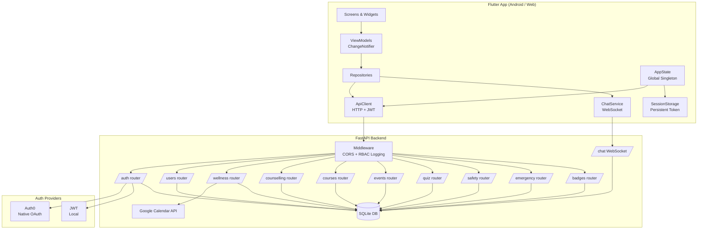

---

## Role Hierarchy & Permissions

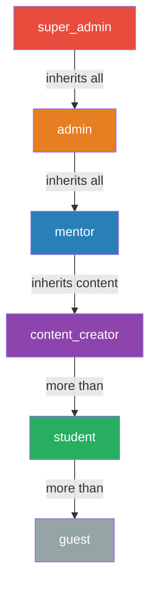

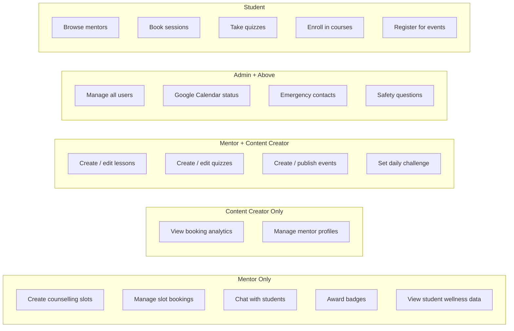

---

## App Navigation Structure

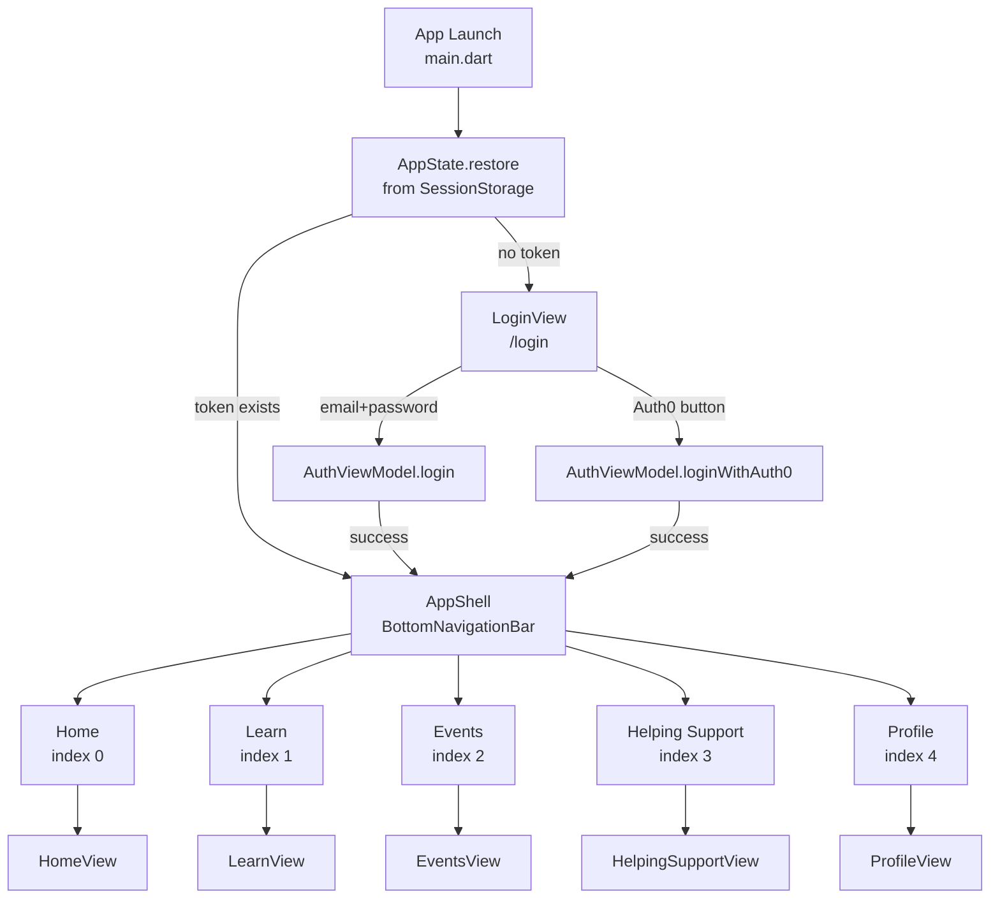

---

## Authentication Flow

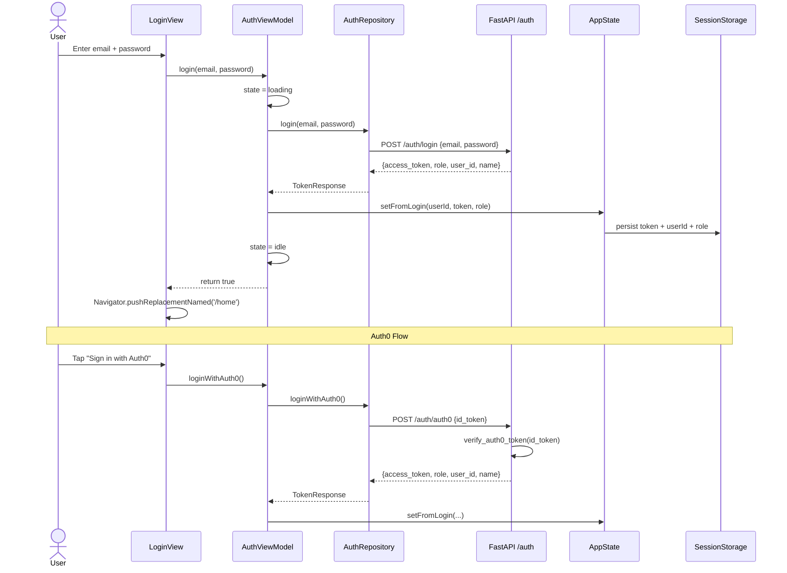

---

## State Management Pattern

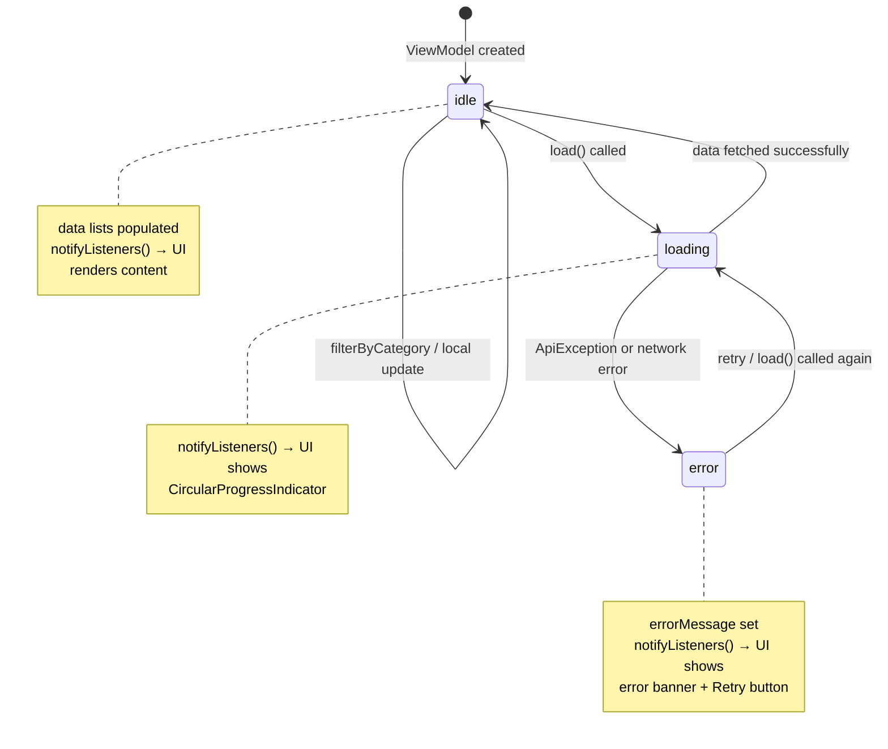

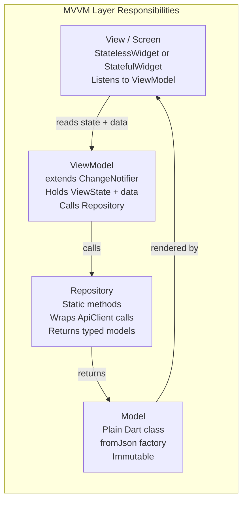

---

## Feature: Home

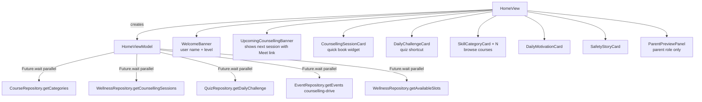

---

## Feature: Learn

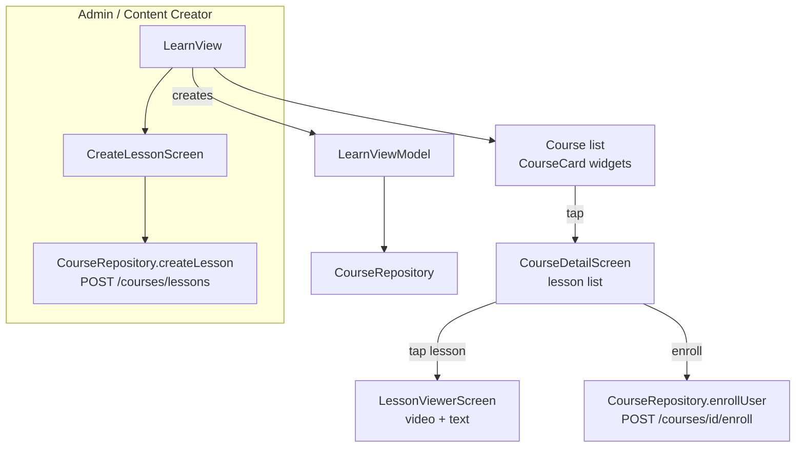

---

## Feature: Events

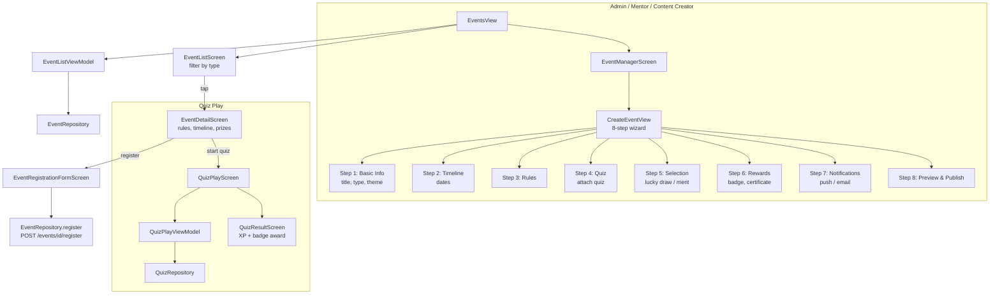

---

## Feature: Helping Support & Counselling

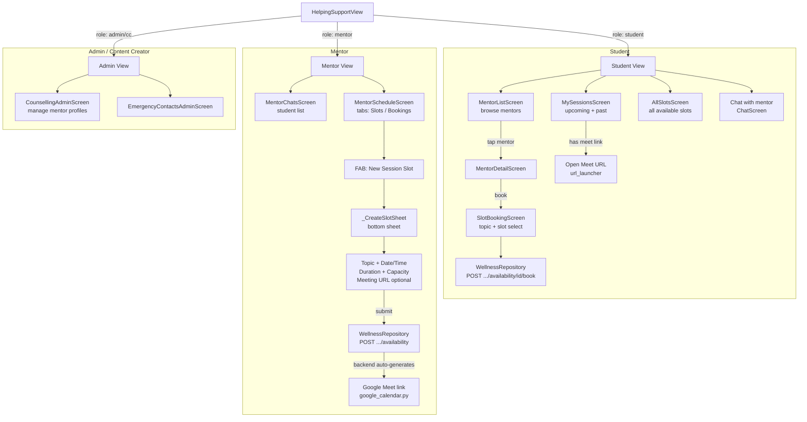

### Counselling Session Booking — Full Sequence

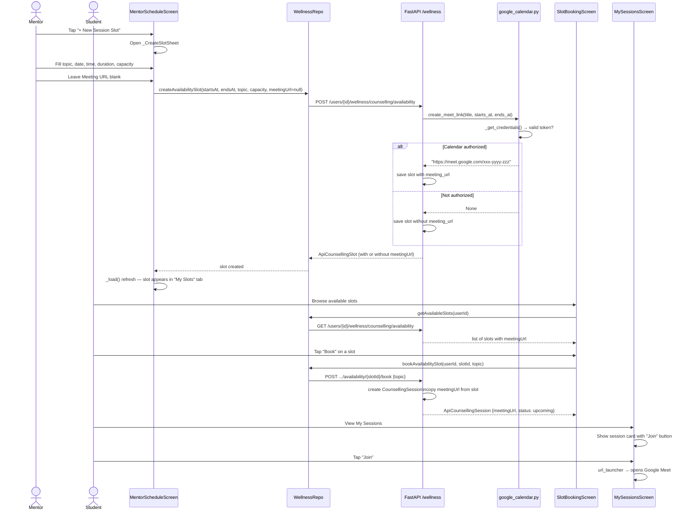

---

## Feature: Chat (WebSocket)

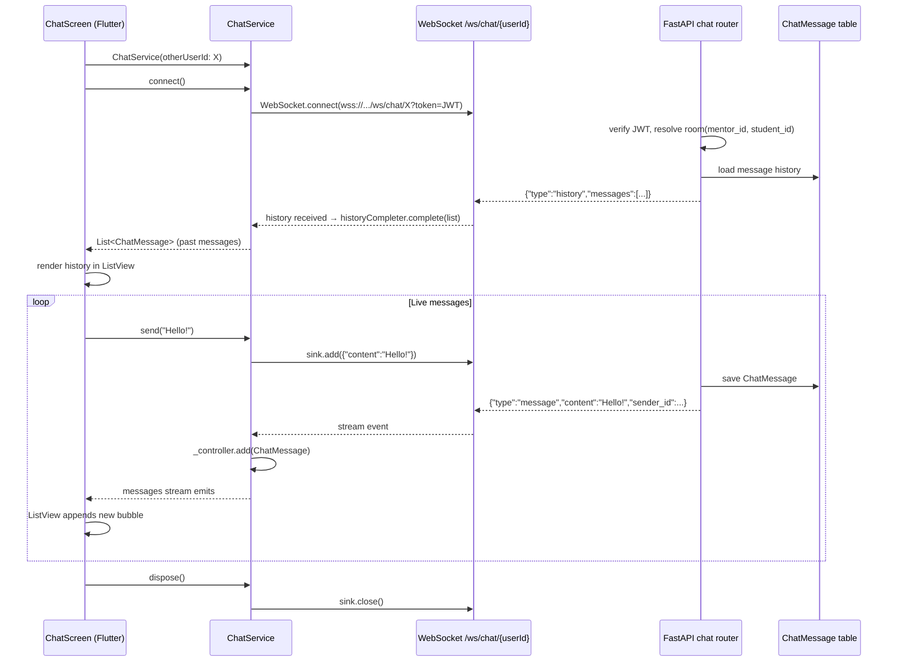

---

## Feature: Profile & Badges

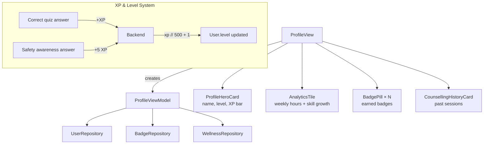

---

## Google Meet Auto-Generation Flow

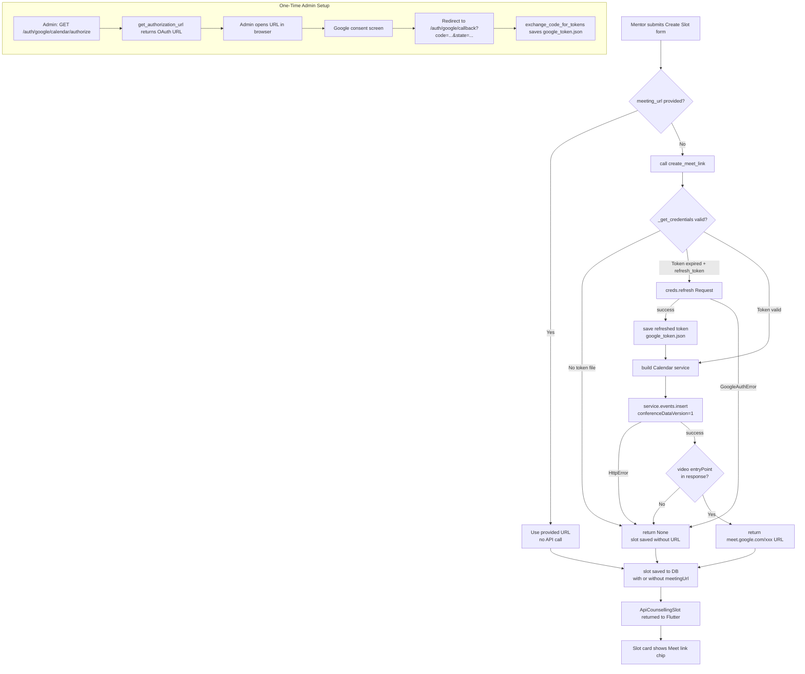

---

## Backend API Map

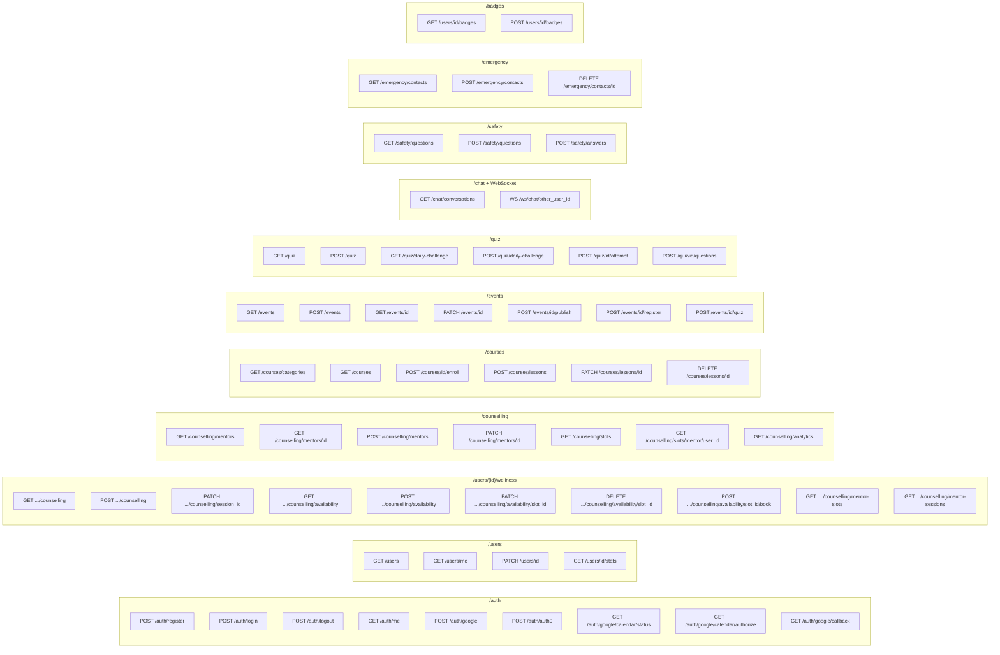

---

## Database Models

```mermaid
erDiagram
    User {
        int id PK
        string name
        string email UK
        string hashed_password
        int age
        int level
        int xp
        enum role
        bool is_active
        string parent_email
        datetime created_at
    }

    CounsellingAvailability {
        int id PK
        int mentor_id FK
        string mentor_name
        datetime starts_at
        datetime ends_at
        string topic
        int capacity
        int booked_count
        string meeting_url
        bool is_active
    }

    CounsellingSession {
        int id PK
        int user_id FK
        int slot_id FK
        int mentor_id FK
        string counsellor_name
        string topic
        datetime scheduled_at
        datetime ends_at
        enum status
        string meeting_url
        string notes
    }

    MentorProfile {
        int id PK
        int user_id FK
        string display_name
        string bio
        string expertise
        string category
        string profile_image_url
        bool is_active
        float rating
        int session_count
    }

    Course {
        int id PK
        string title
        string category
        string description
        string icon_name
    }

    Lesson {
        int id PK
        int course_id FK
        string title
        string content
        string video_url
        int order_index
    }

    Event {
        int id PK
        string title
        enum event_type
        enum status
        string theme_color
        datetime registration_start
        datetime registration_end
        datetime event_start
        datetime event_end
        bool counselling_enabled
        bool scholarship_enabled
    }

    Quiz {
        int id PK
        string title
        string category
        enum difficulty
        int xp_reward
    }

    Question {
        int id PK
        int quiz_id FK
        string question_text
        string option_a
        string option_b
        string option_c
        string option_d
        enum correct_option
    }

    DailyChallenge {
        int id PK
        int quiz_id FK
        date challenge_date
    }

    ChatMessage {
        int id PK
        int mentor_id FK
        int student_id FK
        int sender_id FK
        string content
        datetime created_at
    }

    Badge {
        int id PK
        string icon_name
        string label
        string category
    }

    UserBadge {
        int id PK
        int user_id FK
        int badge_id FK
        datetime earned_at
    }

    EmergencyContact {
        int id PK
        string name
        string phone
        string description
        string category
        bool is_active
    }

    SafetyAwarenessQuestion {
        int id PK
        string question_text
        string option_a
        string option_b
        string option_c
        enum correct_option
        string explanation
        string category
        bool is_active
    }

    User ||--o{ CounsellingSession : "books"
    User ||--o{ MentorProfile : "has"
    User ||--o{ UserBadge : "earns"
    User ||--o{ ChatMessage : "sends"
    CounsellingAvailability ||--o{ CounsellingSession : "generates"
    Course ||--o{ Lesson : "contains"
    Quiz ||--o{ Question : "has"
    Quiz ||--o| DailyChallenge : "featured as"
    Badge ||--o{ UserBadge : "awarded via"
```

---

## Data Flow: ViewState Lifecycle

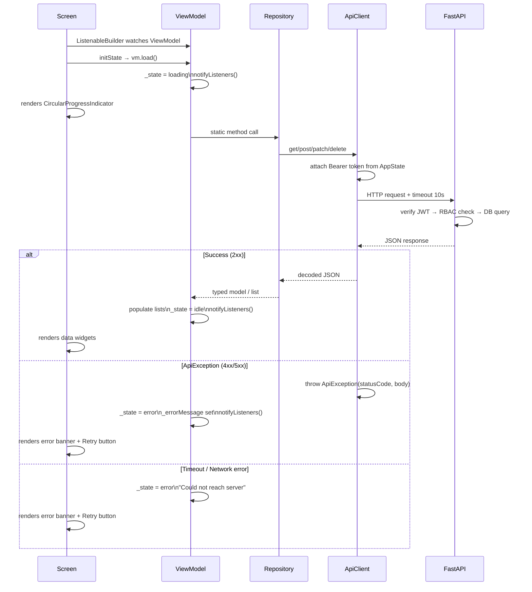

---

## File Structure Summary

```
lib/
├── main.dart                    ← app entry, AppShell (BottomNav), routes
├── app_state.dart               ← global singleton: userId, token, role
├── core/
│   ├── config.dart              ← API URLs, Auth0, timeouts, constants
│   └── colors.dart              ← AppColors design tokens
├── models/
│   ├── auth_models.dart         ← UserRole enum, TokenResponse
│   ├── api_models.dart          ← ApiCounsellingSession, ApiCounsellingSlot, AppUser, ...
│   ├── counselling_models.dart  ← MentorProfile, CounsellingAnalytics
│   ├── event_models.dart        ← EventModel, EventType, EventStatus
│   ├── quiz_models.dart         ← QuizModel, DailyChallengeModel
│   └── ...
├── repositories/
│   ├── api_client.dart          ← HTTP wrapper: get/post/patch/delete/multipart
│   ├── auth_repository.dart     ← login, logout, Auth0 flow
│   ├── wellness_repository.dart ← counselling sessions + slots CRUD
│   ├── counselling_repository.dart ← mentor profiles + analytics
│   ├── course_repository.dart
│   ├── event_repository.dart
│   ├── quiz_repository.dart
│   └── ...
├── viewmodels/
│   ├── view_state.dart          ← enum ViewState { idle, loading, error }
│   ├── auth_viewmodel.dart
│   ├── counselling_viewmodel.dart
│   ├── home_viewmodel.dart
│   ├── learn_viewmodel.dart
│   ├── create_event_viewmodel.dart
│   └── ...
├── screens/
│   ├── auth/login_view.dart
│   ├── home/home_view.dart + widgets/
│   ├── learn/learn_view.dart + ...
│   ├── events/events_view.dart + admin/ + student/
│   ├── helping_support/
│   │   ├── helping_support_view.dart
│   │   ├── mentor/mentor_schedule_screen.dart   ← slot creation + Meet link
│   │   ├── mentor/mentor_chats_screen.dart
│   │   ├── student/slot_booking_screen.dart
│   │   ├── student/my_sessions_screen.dart
│   │   └── widgets/live_session_banner.dart
│   ├── profile/profile_view.dart + widgets/
│   └── wellness/wellness_view.dart + widgets/
└── services/
    ├── chat_service.dart        ← WebSocket connection manager
    └── session_storage.dart     ← platform-safe token persistence

backend/
├── app/
│   ├── main.py                  ← FastAPI app, middleware, router registration
│   ├── config.py                ← Settings from .env
│   ├── database.py              ← SQLAlchemy engine + session
│   ├── dependencies.py          ← get_current_user, require_role, admin_only, mentor_or_above
│   ├── google_calendar.py       ← OAuth2 + Meet link auto-generation
│   ├── models/                  ← SQLAlchemy ORM models
│   ├── schemas/                 ← Pydantic request/response schemas
│   ├── crud/                    ← DB query functions
│   └── routers/
│       ├── auth.py              ← login, register, Auth0, Google Calendar OAuth
│       ├── wellness.py          ← counselling slots + sessions + booking
│       ├── counselling.py       ← mentor profiles + analytics
│       ├── courses.py
│       ├── events.py
│       ├── quiz.py
│       ├── chat.py              ← WebSocket + REST conversation list
│       ├── safety.py
│       ├── emergency.py
│       ├── badges.py
│       └── users.py
└── tests/
    ├── conftest.py              ← shared fixtures, test DB, user helpers
    ├── test_auth.py
    ├── test_events.py
    ├── test_quiz.py
    ├── test_safety.py
    └── test_google_meet.py      ← 27 tests: unit + API for Meet integration
```
